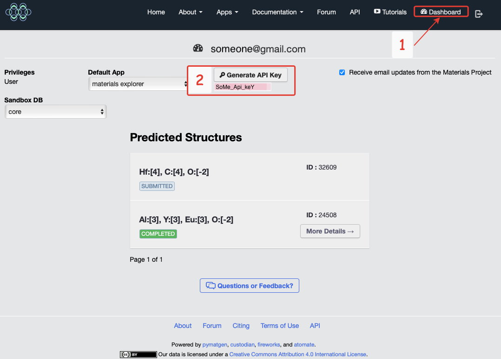

# Machine learning for new materials design
<!--  <> (# This web-site is based on https://github.com/rundocs/jekyll-rtd-theme) -->

An introductory course on machine learning for predicting the properties of solids.

## What it does?

This resource is more of a reference tool. It will help you navigate the methods that can be used to build machine learning-based models to predict material properties.

## Quick start

Initial requirements includes several specific python [libraries](https://mmdlab.github.io/MLMD-course/intro/1_plan_structure.html).
To navigate it might be helpfull to use "Search docs" field.

```tip
To use the Materials Project data base, you need to register (login) on the [website](https://legacy.materialsproject.org/open) and get an API key:
```

